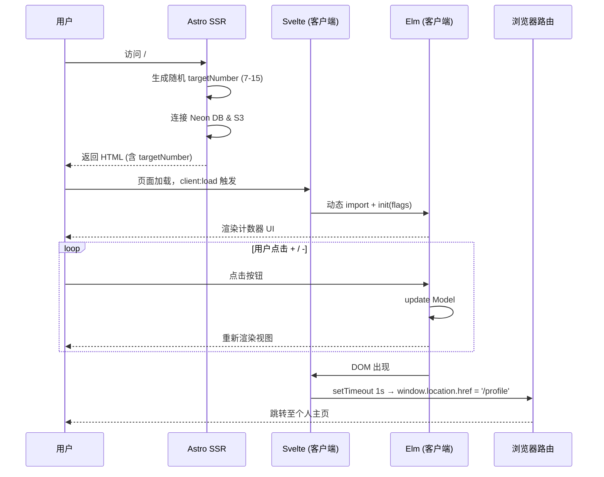

# ASE 项目文档

> **ASE** = **A**stro + **S**velte + **E**lm  
> 一个演示三种前端框架协作能力的全栈 Web 应用。

---

## 目录

1. [项目概览](#项目概览)
2. [技术栈](#技术栈)
3. [目录结构](#目录结构)
4. [核心模块详解](#核心模块详解)
5. [数据流与用户旅程](#数据流与用户旅程)
6. [后端集成](#后端集成)
7. [部署配置](#部署配置)
8. [环境变量](#环境变量)
9. [本地开发](#本地开发)
10. [常用命令](#常用命令)

---

## 项目概览

ASE 是一个展示多框架融合能力的全栈个人主页应用，核心亮点是在同一个项目中同时使用三种不同的前端框架：

- **Astro** 负责页面结构与 SSR（服务端渲染）
- **Svelte** 作为 Elm 与 Astro 之间的胶水层（桥接组件）
- **Elm** 实现纯函数式的交互计数器

用户体验是一个"闯关"式流程：
> 主页 → 完成 Elm 计数器挑战 → 自动跳转至个人主页 → 探索更多社交/链接页面

---

## 技术栈

| 分类 | 技术 | 版本 | 说明 |
|------|------|------|------|
| 核心框架 | [Astro](https://astro.build) | `^5.16.3` | 页面路由、SSR、构建 |
| 前端框架 | [Svelte](https://svelte.dev) | `^5.45.3` | 桥接组件，客户端激活 |
| 函数式 UI | [Elm](https://elm-lang.org) | `0.19.1` | 纯函数式计数器组件 |
| 语言 | TypeScript | `^5.9.3` | 类型安全 |
| 数据库 | [Neon (Postgres)](https://neon.tech) | `postgres ^3.4.7` | 无服务器 PostgreSQL |
| 对象存储 | AWS S3 兼容 (Cloudflare R2 等) | `@aws-sdk/client-s3 ^3.940.0` | 文件/对象存储 |
| 监控 | Sentry | `@sentry/astro ^10.28.0` | 错误追踪 |
| 开发调试 | Spotlight.js | `@spotlightjs/astro ^3.2.6` | 开发环境调试面板 |
| 分析 | Vercel Analytics + Speed Insights | `1.4.0` / `^1.3.1` | 访问统计与性能分析 |

---

## 目录结构

```
ASE/
├── .github/
│   └── workflows/
│       └── deploy.yml          # GitHub Actions CI/CD 流水线
├── .zeabur/
│   └── config.yaml             # Zeabur 平台部署配置
├── public/
│   └── favicon.svg             # 网站图标
├── src/
│   ├── assets/                 # 静态资源（SVG 等）
│   │   ├── astro.svg
│   │   └── background.svg
│   ├── components/
│   │   ├── ElmWrapper.svelte   # ⭐ 核心桥接组件：Svelte → Elm
│   │   └── Welcome.astro       # Astro 默认欢迎组件（模板遗留）
│   ├── elm/
│   │   └── Counter.elm         # ⭐ Elm 函数式计数器
│   ├── layouts/
│   │   └── Layout.astro        # 全局 HTML 布局，含分析组件注入
│   └── pages/
│       ├── index.astro         # 主页：SSR 逻辑 + 计数器挑战
│       ├── profile.astro       # 个人主页：挑战通关后的奖励页
│       └── explore-more.astro  # 社交链接聚合页
├── astro.config.ts             # Astro + 插件配置，适配器选择逻辑
├── elm.json                    # Elm 项目配置与依赖
├── package.json                # Node.js 依赖与脚本
├── svelte.config.ts            # Svelte 配置
├── tsconfig.json               # TypeScript 配置
└── zeabur.json                 # Zeabur 部署配置（JSON 格式）
```

---

## 核心模块详解

### 1. `src/elm/Counter.elm` — Elm 计数器

标准的 Elm TEA（The Elm Architecture）应用。

**Model（状态）**
```elm
type alias Model = 
  { count : Int          -- 当前计数值
  , targetNumber : Int   -- 目标数字（由服务端随机生成，通过 flags 传入）
  , hasReachedTarget : Bool  -- 是否已达到目标
  }
```

**Msg（消息/事件）**
```elm
type Msg = Increment | Decrement
```

**核心逻辑**
- 计数从 `0` 开始，不能减到负数
- 当 `count >= targetNumber` 时，`hasReachedTarget` 变为 `True`
- 达到目标后，页面渲染一个带有特殊 ID `success-message` 的 DOM 节点，供 Svelte 层监听

**Flags（初始化参数）**
```elm
main : Program { targetNumber : Int } Model Msg
```
`targetNumber` 由外部（Svelte）在初始化时注入。

---

### 2. `src/components/ElmWrapper.svelte` — Svelte 桥接层

负责在客户端动态加载并初始化 Elm 模块。

**关键流程：**

```
onMount 触发
  └─ 动态 import('../elm/Counter.elm')   ← vite-plugin-elm 处理
       └─ Elm.Counter.init({ node, flags: { targetNumber } })
            └─ 每 100ms 轮询 DOM 中是否出现 #success-message
                 └─ 检测到后，延迟 1000ms 跳转至 /profile
```

**Props**
| 属性 | 类型 | 默认值 | 说明 |
|------|------|--------|------|
| `targetNumber` | `number` | `10` | 目标计数值，由父页面传入 |

> [!NOTE]
> Svelte 使用 `bind:this={node}` 获取挂载点，然后将其传给 `Elm.Counter.init()`，实现 Elm 在指定 DOM 节点渲染。

---

### 3. `src/pages/index.astro` — 主页（SSR）

**服务端逻辑（`---` 代码块）：**
1. 生成随机目标数字 `targetNumber`（范围 7-15）
2. 初始化 Neon Postgres 连接（`DATABASE_URL`）
3. 初始化 S3 客户端并列举存储桶文件（连接失败时静默处理）

**客户端渲染：**
- `<ElmWrapper targetNumber={targetNumber} client:load />` — 使用 `client:load` 指令立即激活 Svelte/Elm 组件
- 友情链接区域（glassmorphism 玻璃拟态风格卡片）

> [!IMPORTANT]
> `client:load` 是 Astro 的"孤岛架构"指令，不添加此指令则组件为纯静态 HTML，Elm 交互将无法工作。

---

### 4. `src/pages/profile.astro` — 个人主页

挑战通关后的奖励页面，包含：
- 庆祝动画（bounce keyframe）
- 返回主页按钮
- 跳转至「探索更多」页按钮

---

### 5. `src/pages/explore-more.astro` — 社交链接聚合页

展示作者的各类社交平台和外部链接：

| 平台 | 链接 |
|------|------|
| GitHub (Inverstar) | https://github.com/Inverstar |
| GitHub (ainexur68) | https://github.com/ainexur68 |
| Vercel 博客 | https://ase-seven.vercel.app |
| Bilibili | https://space.bilibili.com/57902504/dynamic |
| Twitter/X | https://x.com/Inknight_Star |
| 邮箱 | lnq1208@163.com |
| Blinko | https://vex.us.ci/share |

---

### 6. `src/layouts/Layout.astro` — 全局布局

所有页面的 HTML 外壳，自动注入：
- `@vercel/speed-insights` — 性能监控
- `@vercel/analytics` — 访问统计

---

## 数据流与用户旅程



---

## 后端集成

### Neon PostgreSQL

```typescript
// src/pages/index.astro
const sql = postgres(import.meta.env.DATABASE_URL);
```

当前代码中数据库连接已建立，但查询语句被注释掉（`// const posts = await sql\`select * from posts\``），仅作连接测试用途。

### S3 兼容存储

```typescript
const s3 = new S3Client({
  region: import.meta.env.S3_REGION,
  endpoint: import.meta.env.S3_ENDPOINT,  // 支持 Cloudflare R2 等自定义端点
  credentials: { accessKeyId, secretAccessKey }
});
```

连接失败时静默处理（返回空数组），不影响页面正常渲染。

---

## 部署配置

### 适配器选择逻辑

```typescript
// astro.config.ts
const IS_VERCEL = process.env.VERCEL === '1';

adapter: IS_VERCEL 
  ? vercel({})              // Vercel 平台 → Serverless 适配器
  : node({ mode: 'standalone' })  // 其他平台（Zeabur/本地/Docker）→ Node 独立服务器
```

### Vercel 部署

通过 GitHub Actions 自动部署（`.github/workflows/deploy.yml`）：
- 触发条件：`main` 分支的 push 或 PR
- 运行环境：Node.js 18.x
- 构建命令：`npm install && npm run build`
- 部署工具：`amondnet/vercel-action@v25`

### Zeabur 部署

通过 `.zeabur/config.yaml` 和 `zeabur.json` 配置：

| 配置项 | 值 |
|--------|-----|
| 构建命令 | `npm install && npm run build` |
| 服务入口 | `dist/server/entry.mjs` |
| 监听端口 | `3000` (HTTP) |
| Node 版本 | `18` |
| 超时时间 | 60 秒 |

---

## 环境变量

| 变量名 | 说明 | 必须 |
|--------|------|------|
| `DATABASE_URL` | Neon PostgreSQL 连接字符串 | ✅ |
| `S3_REGION` | S3 存储区域（如 `auto`） | ✅ |
| `S3_ENDPOINT` | S3 端点 URL（用于自定义 R2 等） | ✅ |
| `S3_ACCESS_KEY` | S3 访问密钥 ID | ✅ |
| `S3_SECRET_KEY` | S3 访问密钥 Secret | ✅ |
| `S3_BUCKET` | S3 存储桶名称 | ✅ |
| `VERCEL_TOKEN` | Vercel 部署令牌（GitHub Secrets） | CI/CD |
| `VERCEL_ORG_ID` | Vercel 组织 ID（GitHub Secrets） | CI/CD |
| `VERCEL_PROJECT_ID` | Vercel 项目 ID（GitHub Secrets） | CI/CD |

---

## 本地开发

### 前置要求

- Node.js >= 18
- npm

### 启动步骤

```sh
# 1. 安装依赖
npm install

# 2. 创建本地环境变量文件（参考上方环境变量表）
# 创建 .env 文件并填入对应的值

# 3. 启动开发服务器
npm run dev
# 访问 http://localhost:4321
```

> [!TIP]
> 开发模式下会自动启用 Spotlight.js 调试面板，可在浏览器中查看 Sentry 事件和性能数据。

---

## 常用命令

| 命令 | 说明 |
|------|------|
| `npm run dev` | 启动开发服务器（`localhost:4321`） |
| `npm run build` | 构建生产包至 `./dist/` |
| `npm run preview` | 本地预览生产构建 |
| `npm start` | 启动生产服务器（需先 build） |
| `npm run astro ...` | 运行 Astro CLI 命令 |

---

## 架构总结

```
┌─────────────────────────────────────────────────────┐
│                    Astro (SSR)                       │
│  ┌─────────────┐ ┌──────────────┐ ┌──────────────┐  │
│  │  index.astro│ │profile.astro │ │explore-more  │  │
│  │  (服务端逻辑) │ │  (奖励页面)  │ │  (社交链接)  │  │
│  └──────┬──────┘ └──────────────┘ └──────────────┘  │
│         │ 传递 targetNumber                           │
│  ┌──────▼──────────────────────────┐                 │
│  │   ElmWrapper.svelte (桥接层)    │ ← client:load   │
│  │   动态加载 + 初始化 Elm          │                 │
│  │   轮询 DOM + 路由跳转           │                 │
│  └──────┬──────────────────────────┘                 │
│         │ flags: { targetNumber }                     │
│  ┌──────▼──────────────────────────┐                 │
│  │       Counter.elm (TEA)         │                 │
│  │   Model → Update → View        │                 │
│  │   纯函数式，无副作用             │                 │
│  └─────────────────────────────────┘                 │
│                                                      │
│  后端服务: Neon PostgreSQL + S3 存储                  │
│  监控: Sentry + Spotlight.js                         │
│  分析: Vercel Analytics + Speed Insights             │
└─────────────────────────────────────────────────────┘
```
